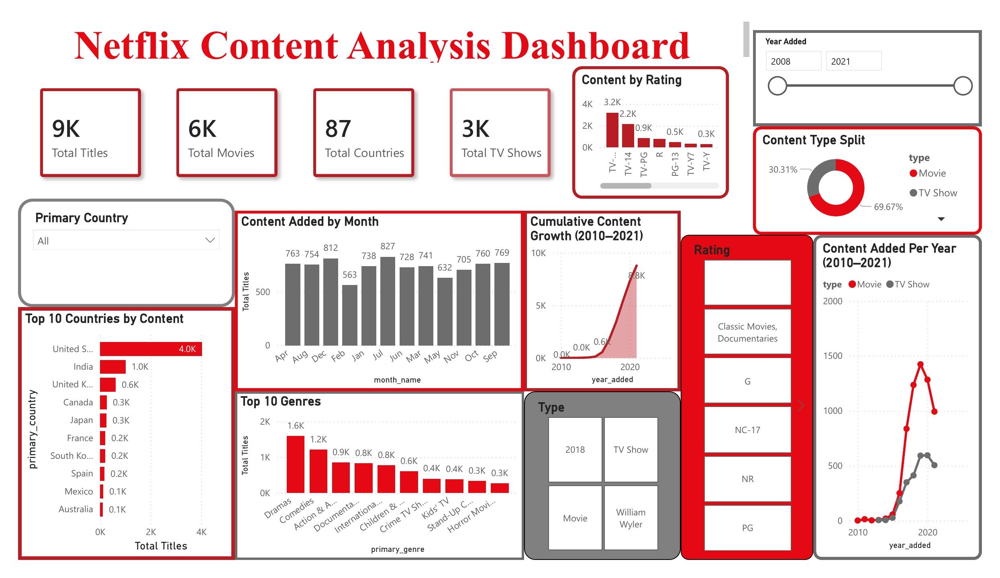

# 🎬 Netflix Decoded — Content Analysis

> Uncovering Netflix content trends through Python, SQL, and Power BI


---

## 📌 Overview

This end-to-end data analytics project analyzes **8,794 Netflix titles** spanning Movies and TV Shows across 86 countries. The goal was to uncover content trends, genre preferences, country-wise distribution, and growth patterns using a complete analytics pipeline — from raw data to an interactive dashboard.

**Key questions answered:**
- How has Netflix content grown year over year?
- Which countries and genres dominate Netflix?
- What is the content rating breakdown?
- Who are the most prolific directors on Netflix?
- When does Netflix add the most content?

---

## 📂 Dataset

| Property | Details |
|----------|---------|
| **Source** | Netflix Movies and TV Shows Dataset (Kaggle) |
| **Records** | 8,807 rows × 12 columns |
| **After Cleaning** | 8,794 rows × 19 columns |
| **Key Features** | Type, Title, Director, Country, Date Added, Release Year, Rating, Duration, Genre |
| **Missing Values** | Director (29.91%), Cast (9.37%), Country (9.44%) — all handled |

---

## 🛠️ Tools & Technologies

| Tool | Purpose |
|------|---------|
| **Python** (pandas, matplotlib) | Data loading, EDA, cleaning, feature engineering |
| **Jupyter Notebook** | Interactive analysis environment |
| **PostgreSQL** | SQL-based business intelligence queries |
| **SQLAlchemy** | Python-to-PostgreSQL data pipeline |
| **Power BI** | Interactive dashboard & data visualization |
| **MS Word** | Detailed project report |

---

## 🔄 Project Workflow

```
Raw Excel  →  Python (EDA & Cleaning)  →  PostgreSQL (SQL Analysis)  →  Power BI (Dashboard)
```

### Step 1 — Data Loading & Exploration
- Loaded `netflix_titles.xlsx` using pandas
- Inspected shape, data types, null counts with `df.info()`, `df.describe()`, `df.isnull().sum()`

### Step 2 — Data Cleaning
- Filled missing `director` and `cast` with `'Unknown'`
- Filled missing `country` and `rating` with mode
- Dropped 13 rows where `date_added` or `duration` was null

### Step 3 — Feature Engineering
- Extracted `year_added`, `month_added`, `month_name` from `date_added`
- Created `primary_country` — first country from multi-country entries
- Created `primary_genre` — first genre from multi-genre entries
- Extracted `duration_value` and `duration_unit` from `duration`
- Created `month_order` for correct calendar sorting

### Step 4 — SQL Analysis (PostgreSQL)
- Loaded cleaned DataFrame into PostgreSQL via SQLAlchemy
- Wrote **10 business queries** covering:
  - Movies vs TV Shows distribution
  - Top 10 countries and genres
  - Year-over-year content growth
  - Rating breakdown
  - Top directors
  - Average movie duration
  - Monthly content additions
  - Top genres per content type (Window Function)
  - Top countries per content type (CTE + Window Function)

### Step 5 — Power BI Dashboard
- Built interactive dashboard with KPI cards, bar charts, donut chart, line chart, area chart
- Slicers: Content Type, Rating, Primary Country, Year Added

---

## 📊 Dashboard Preview



**KPIs at a Glance:**

| Metric | Value |
|--------|-------|
| Total Titles | 8,794 |
| Total Movies | 6,128 |
| Total TV Shows | 2,666 |
| Total Countries | 86 |

**Visuals included:**
- Content Type Split (Donut Chart)
- Top 10 Countries by Content (Bar Chart)
- Top 10 Genres (Column Chart)
- Content by Rating (Column Chart)
- Content Added by Month (Column Chart)
- Content Added Per Year (Line Chart)
- Cumulative Content Growth (Area Chart)

---

## 📈 Key Results & Insights

| # | Insight |
|---|---------|
| 1 | **Movies dominate** Netflix at 69.7% vs TV Shows at 30.3% |
| 2 | **United States** produces the most content (2,800+ titles) |
| 3 | **Dramas** is the most popular genre on Netflix |
| 4 | **TV-MA** is the most common content rating |
| 5 | Netflix content grew **exponentially** between 2015–2019 |
| 6 | **July** sees the highest content additions per month |
| 7 | Average movie duration is **99 minutes** |
| 8 | Most TV shows have only **1 season** |
| 9 | **India** is the 2nd largest content producer after the US |
| 10 | **Rajiv Chilaka** is the most prolific director on Netflix |

---

## 🗂️ Repository Structure

```
📦 netflix-decoded
 ┣ 📄 netflix_titles.xlsx              # Raw dataset
 ┣ 📄 netflix_cleaned.csv              # Cleaned dataset (Python output)
 ┣ 📓 netflix_analysis.ipynb           # Jupyter Notebook (EDA & Cleaning)
 ┣ 📄 Netflix_SQL_Queries.sql          # All 10 PostgreSQL queries
 ┣ 📊 Netflix_BI_Dashboard.pbix        # Power BI dashboard file
 ┣ 📄 dashboard.pdf                    # Exported dashboard (PDF)
 ┗ 📄 README.md                        # Project documentation
```

---

## ▶️ How to Run

### Python (EDA & Cleaning)
```bash
# Clone the repository
git clone https://github.com/Bhavyansh004/netflix-decoded.git
cd netflix-decoded

# Install dependencies
pip install pandas matplotlib sqlalchemy psycopg2-binary openpyxl

# Open the notebook
jupyter notebook netflix_analysis.ipynb
```

### PostgreSQL (SQL Queries)
```bash
# 1. Create database in pgAdmin
CREATE DATABASE netflix_analysis;

# 2. Run the notebook to load cleaned data into PostgreSQL

# 3. Open Netflix_SQL_Queries.sql in pgAdmin and execute
```

### Power BI Dashboard
```
1. Open Netflix_BI_Dashboard.pbix in Power BI Desktop
2. Update data source path if needed
3. Refresh the dataset
```

---

## 📋 SQL Queries Included

| # | Query | Technique |
|---|-------|-----------|
| Q1 | Movies vs TV Shows count & % | `COUNT`, `SUM OVER()` |
| Q2 | Top 10 countries by content | `GROUP BY`, `ORDER BY` |
| Q3 | Year-over-year content growth | Cumulative `SUM OVER()` |
| Q4 | Top 10 genres | `GROUP BY`, `LIMIT` |
| Q5 | Rating breakdown with % | Subquery, `ROUND` |
| Q6 | Top 10 directors with type split | `CASE WHEN`, `COUNT` |
| Q7 | Avg movie duration + above/below avg | Scalar Subquery |
| Q8 | Most content added by month | `GROUP BY`, `ORDER BY` |
| Q9 | Top 3 genres per content type | `CTE` + `RANK()` window |
| Q10 | Top 5 countries per content type | `CTE` + `ROW_NUMBER()` window |

---

## 👤 Author

**Bhavyansh Nandwana**
📧 [nandwanabhavyansh1234@gmail.com](mailto:nandwanabhavyansh1234@gmail.com)
🔗 [LinkedIn](https://www.linkedin.com/in/bhavyansh-n-617627258/)
🐙 [GitHub](https://github.com/Bhavyansh004)

---

*If you found this project helpful, please consider giving it a ⭐ on GitHub!*
